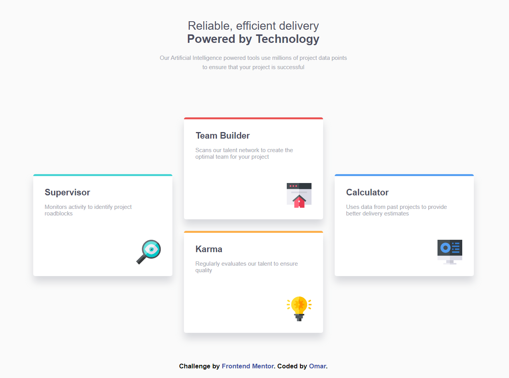

# Frontend Mentor - Four card feature section


This is a solution to the [Four card feature section challenge on Frontend Mentor](https://www.frontendmentor.io/challenges/four-card-feature-section-weK1eFYK). Frontend Mentor challenges help you improve your coding skills by building realistic projects. 

## Table of contents

- [Overview](#overview)
  - [The challenge](#the-challenge)
  - [Screenshot](#screenshot)
  - [Links](#links)
- [My process](#my-process)
  - [Built with](#built-with)
  - [What I learned](#what-i-learned)
  - [Continued development](#continued-development)
  - [Useful resources](#useful-resources)
- [Author](#author)
- [Acknowledgments](#acknowledgments)

## Overview

### The challenge

Users should be able to:

- View the optimal layout for the site depending on their device's screen size

### Screenshot

- Large Screen

- Medium Screen

- Mobile

  

### Links

- Solution URL: [Solution Here]()
- Live Site URL: [Live Site Here]()

## My process

### Built with

- Semantic HTML5 markup
- CSS custom properties
- Flexbox
- CSS Grid

### What I learned

```html
<h1>Some HTML code I'm proud of</h1>
```
```css
.fav-color {
  color: darkblue;
}
```
### Continued development   
  - I'm going to learn JavaScript then React Library and then Node.js so  I could work as full-stack

### Useful resources

  - Arabic 2020 
    - [HTML-Course](https://www.youtube.com/watch?v=6QAELgirvjs&list=PLDoPjvoNmBAw_t_XWUFbBX-c9MafPk9ji)
    - [CSS-Course](https://www.youtube.com/watch?v=X1ulCwyhCVM&list=PLDoPjvoNmBAzjsz06gkzlSrlev53MGIKe)
    - [JS-Course](https://www.youtube.com/watch?v=GM6dQBmc-Xg&list=PLDoPjvoNmBAx3kiplQR_oeDqLDBUDYwVv)

## Author

- LinkedIn - [@Omar](https://www.linkedin.com/feed/)
- Frontend Mentor - [@Omar](https://www.frontendmentor.io/home)


